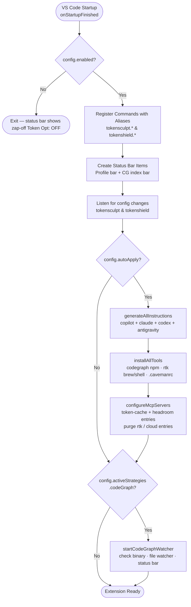
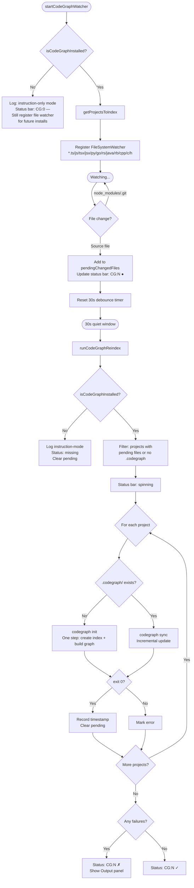
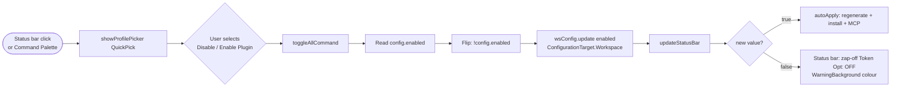
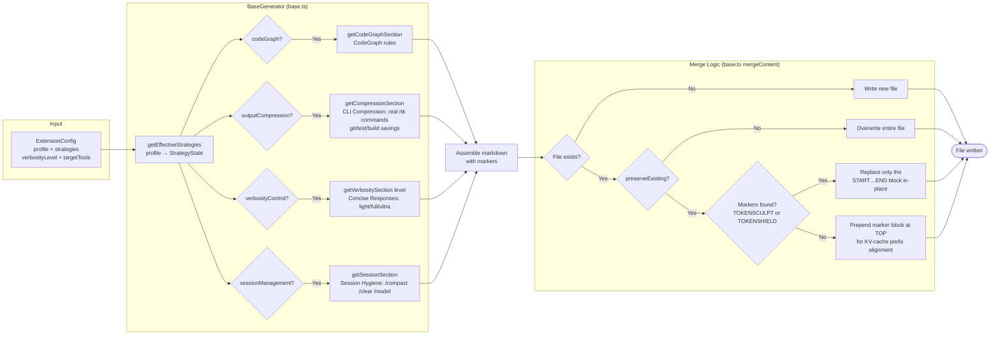
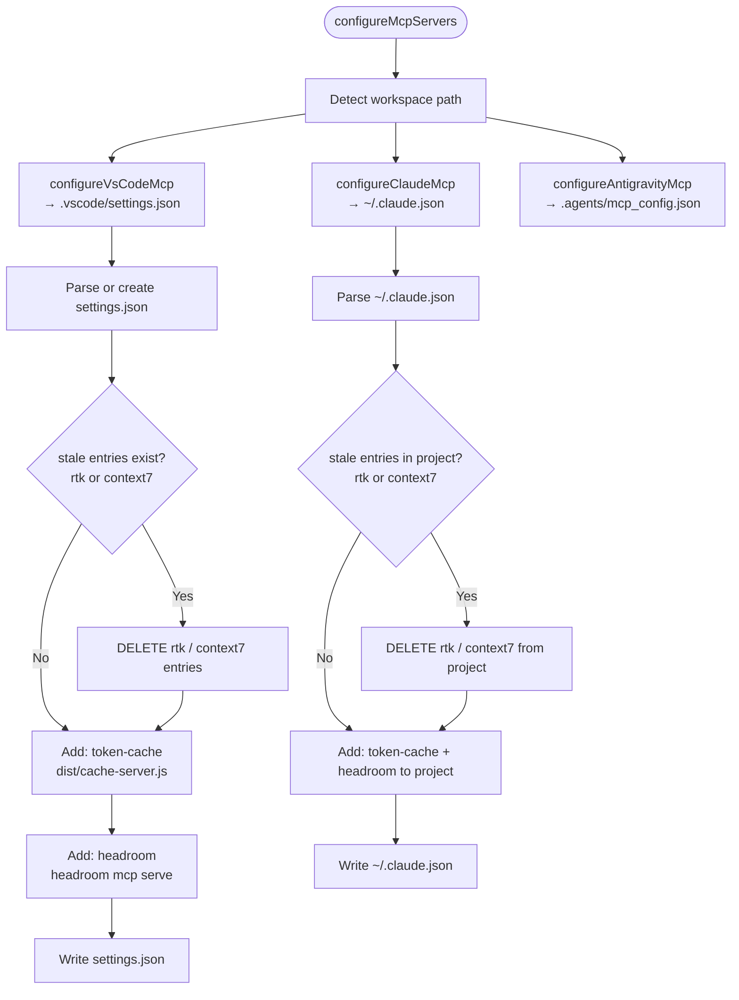
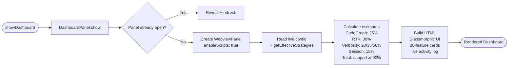

# TokenSculpt — Architecture Document

**Version:** 1.0.18  
**Date:** September 2026  
**Type:** Universal AI Token & Cost Optimizer Extension  
**Source:** `tokensculpt/`

This document describes the internal architecture, component interactions, data flows, and design decisions of the **TokenSculpt** extension.

---

## 1. Overview

TokenSculpt is an efficiency platform and IDE extension that reduces LLM token consumption across Google Antigravity IDE, GitHub Copilot, Cursor, Windsurf, Claude Code, and OpenAI Codex. It operates through three complementary mechanisms:

| Mechanism | How it works | Requires binary? |
|---|---|---|
| **Instruction file injection** | Writes optimization rules into `AGENTS.md`, `.agents/rules/tokensculpt.md`, `.github/copilot-instructions.md`, `CLAUDE.md`, `.codex/instructions.md` | No |
| **Local MCP servers** | Configures 100% on-device MCP servers: `token-cache` (AST skeletons, semantic cache, context pruning), `headroom` (reversible CCR), `codegraph` (symbol exploration) | Node.js (for built-in server) |
| **CLI tool integration** | Installs/configures CodeGraph (semantic indexing) and RTK (CLI output compression) | Yes |

The instruction-file approach is the primary zero-overhead mechanism and works immediately on any workspace. Local MCP and tool integration provide deeper structural and runtime savings.


---

## 2. Real Tool Packages

| Tool | Package / Install | Binary | Purpose |
|---|---|---|---|
| **CodeGraph** | `npm install -g @colbymchenry/codegraph` | `codegraph` | Semantic code-graph index — 58% fewer AI tool calls, 22% faster answers. 56k ★ MIT |
| **RTK** | `brew install rtk` or `curl \| sh` | `rtk` | CLI proxy — 60–90% token savings on git, test, build, ls, grep commands. 67k ★ Apache 2.0 |
| **Headroom** | `pip install headroom-ai[all]` | `headroom` | Reversible context compression (CCR) & SmartCrusher for massive JSON/logs (100% local) |

> **Note:** The earlier transcript referenced `codegraph`, `rtk-compress`, and `caveman` as npm package names. `rtk-compress` and `caveman` do not exist on npm. The real packages are `@colbymchenry/codegraph` and `rtk` (Rust binary via brew/curl).

### CodeGraph: Two Separate Roles

Installing the binary and exposing it to the AI are independent concerns:

| Role | How | Who uses it |
|---|---|---|
| **CLI (index management)** | `npm install -g @colbymchenry/codegraph` → binary on `$PATH` | You — `codegraph init`, `codegraph sync`, `codegraph status` |
| **MCP server (AI query interface)** | `.vscode/settings.json` / `mcp.json` entry: `codegraph mcp` | Copilot / Claude Code — spawns `codegraph mcp` as a stdio subprocess, exposes `codegraph_explore` tool |

The MCP entry does **not** install anything — it tells the AI host to launch the already-installed binary in server mode:

```
Your terminal   ──→  codegraph sync          (CLI — you manage the index)
Copilot / Claude ──→  codegraph mcp (stdio)   (MCP server — AI queries the index)
                             ↓
                  codegraph_explore tool available during chat
```

Without the MCP config entry, Copilot has no knowledge the binary exists and cannot call `codegraph_explore`.

---

## 3. High-Level Architecture

```mermaid
graph TB
    subgraph VS_CODE["VS Code Host"]
        EXT["extension.ts\n(Entry Point — 23 commands with aliases)"]
        CFG["config.ts\n(Settings & Profiles)"]
        CONST["constants.ts\n(Markers, ToolInstallEntry types)"]
    end

    subgraph GENERATORS["Instruction Generators"]
        GEN_IDX["generators/index.ts\n(Orchestrator)"]
        GEN_CP["generators/copilot.ts\n(→ .github/copilot-instructions.md)"]
        GEN_CL["generators/claude.ts\n(→ CLAUDE.md)"]
        GEN_CD["generators/codex.ts\n(→ .codex/instructions.md)"]
        GEN_AG["generators/antigravity.ts\n(→ AGENTS.md & .agents/rules/)"]
        GEN_BASE["generators/base.ts\n(Marker merge + abstract sections)"]
    end

    subgraph INSTALLER["Tool Installer"]
        INST["installer/installer.ts\n(npm / brew / shell install)"]
        PM["installer/packageManager.ts\n(Detect npm/yarn/pnpm)"]
    end

    subgraph MCP["MCP Configurator"]
        MCP_CFG["mcp/configurator.ts\n(100% On-Device: token-cache + headroom + codegraph)"]
    end

    subgraph STRATEGIES["Strategies"]
        CG["strategies/codegraph.ts\n(File Watcher + Per-Project Reindex)"]
        VAL["strategies/validator.ts\n(Health Check Report)"]
    end

    subgraph UI["User Interface"]
        SB["ui/statusBar.ts\n(Profile + ON/OFF indicator)"]
        QP["ui/quickPick.ts\n(Enable/Disable · Validate · Profile · Toggle)"]
        DASH["ui/dashboard.ts\n(Webview: Token Savings Dashboard)"]
        PP["ui/projectPicker.ts\n(CodeGraph Project Manager)"]
    end

    subgraph WORKSPACE["Generated Workspace Files"]
        CP_FILE[".github/copilot-instructions.md"]
        CL_FILE["CLAUDE.md"]
        CD_FILE[".codex/instructions.md"]
        AG_FILE["AGENTS.md & .agents/rules/tokensculpt.md"]
        CAV_FILE[".cavemanrc  (verbosity hints)"]
        VS_SETTINGS[".vscode/settings.json\n(MCP: token-cache + headroom)"]
        CG_DIR[".codegraph/  (CodeGraph index)"]
    end

    subgraph EXTERNAL["On-Device Tools & MCP Servers"]
        CODEGRAPH_BIN["codegraph v1.1.3\n(@colbymchenry/codegraph)\nSQLite knowledge graph"]
        RTK_BIN["rtk v0.43.0\n(brew install rtk)\nCLI output proxy — hooks not MCP"]
        HEADROOM_MCP["Headroom CCR\n(headroom mcp serve)"]
        TOKEN_CACHE_MCP["Token-Cache MCP\n(dist/cache-server.js)"]
    end

    EXT --> CFG
    EXT --> GEN_IDX
    EXT --> INST
    EXT --> MCP_CFG
    EXT --> CG
    EXT --> VAL
    EXT --> SB
    EXT --> QP
    EXT --> DASH
    EXT --> PP

    GEN_IDX --> GEN_CP & GEN_CL & GEN_CD & GEN_AG
    GEN_CP & GEN_CL & GEN_CD & GEN_AG --> GEN_BASE
    GEN_CP --> CP_FILE
    GEN_CL --> CL_FILE
    GEN_CD --> CD_FILE
    GEN_AG --> AG_FILE

    INST --> PM
    INST --> CAV_FILE
    INST --> CODEGRAPH_BIN
    INST --> RTK_BIN

    MCP_CFG --> VS_SETTINGS
    MCP_CFG --> TOKEN_CACHE_MCP & HEADROOM_MCP
    MCP_CFG --> CODEGRAPH_BIN

    CG --> CODEGRAPH_BIN
    CG --> CG_DIR
    PP --> CFG
    VAL --> CODEGRAPH_BIN & RTK_BIN
    VAL --> CP_FILE & CL_FILE & CD_FILE
```



---

## 4. Extension Activation Lifecycle



**Core Registered Commands (`tokensculpt.*`, with `tokenshield.*` aliases):**

| Command ID | Title | Purpose |
|---|---|---|
| `tokensculpt.hub` | Open Control Hub | QuickPick master control hub for profiles, toggles, and status |
| `tokensculpt.toggle` | Toggle On/Off | Globally enable or pause all TokenSculpt optimizations |
| `tokensculpt.toggleFeature` | Toggle Feature (1-Click Switch) | Interactive QuickPick to toggle any of the 20 features |
| `tokensculpt.switchProfile` | Select Optimization Profile | Switch between Full, Debug, Planning, Review, and Custom |
| `tokensculpt.dashboard` | Open Savings Dashboard | Webview dashboard with real-time tokens & spend saved |
| `tokensculpt.healthCheck` | Run Health Check | Diagnostic validation across all 20 strategies and local tools |
| `tokensculpt.regenerate` | Regenerate Instruction Files | Re-emit optimized directives to `AGENTS.md`, `CLAUDE.md`, `.github/` |
| `tokensculpt.exclusions` | Edit Context Exclusions | Interactive manager for `.copilotignore` and folder exclusions |
| `tokensculpt.newSession` | Start New Session | Archive current session savings to disk and reset active counters |
| `tokensculpt.setupTools` | Setup CLI Tools | Check and install companion binaries (`@colbymchenry/codegraph`, `rtk`) |
| `tokensculpt.configureMcp` | Configure MCP Servers | Wire on-device MCP servers in VS Code, Antigravity, and Claude |
| `tokensculpt.reindex` | Reindex Code Graph | Manually trigger AST symbol reindexing in `.codegraph/` |
| `tokensculpt.exportReport` | Export Savings Report | Export verified savings telemetry in Markdown, JSON, or CSV |

---

## 5. Configuration & Profiles (`config.ts`)

Built-in profiles enforce quality-trade-off constraints across all **20 modular optimization strategies**:

| # | Strategy Key | Feature Name | Full | Debug | Planning | Review |
|---|---|---|:---:|:---:|:---:|:---:|
| 1 | `codeGraph` | CodeGraph Pre-Indexing | ✓ | ✓ | ✓ | ✓ |
| 2 | `outputCompression` | CLI Output Compression (RTK) | ✓ | ✗ | ✓ | ✓ |
| 3 | `verbosityControl` | Concise AI Responses | ✓ | ✓ | ✗ | ✓ |
| 4 | `sessionManagement` | Context Compaction & Session Hygiene | ✓ | ✓ | ✓ | ✗ |
| 5 | `semanticCache` | Local Semantic Cache (`token-cache` MCP) | ✓ | ✓ | ✓ | ✓ |
| 6 | `astSkeleton` | AST Skeleton Pruning (`skeleton_view` MCP) | ✓ | ✓ | ✓ | ✓ |
| 7 | `contextExclusion` | Smart Context Exclusions | ✓ | ✓ | ✓ | ✓ |
| 8 | `diffOnlyOutput` | Diff-Only Output | ✓ | ✗ | ✓ | ✓ |
| 9 | `agentGuardrails` | Autonomous Loop Guardrails | ✓ | ✓ | ✗ | ✓ |
| 10 | `smartModelRouting` | Smart Model Routing (Dynamic Pricing) | ✓ | ✓ | ✓ | ✓ |
| 11 | `gitDiffContext` | Git Diff Scoping | ✓ | ✓ | ✓ | ✓ |
| 12 | `kvCacheAlignment` | Prompt Prefix Caching (Top Placement) | ✓ | ✓ | ✓ | ✓ |
| 13 | `commentStripper` | License Header / Comment Stripper | ✓ | ✗ | ✓ | ✗ |
| 14 | `testFailureIsolator` | Test Failure Isolator | ✓ | ✓ | ✗ | ✓ |
| 15 | `rangeSlicing` | Windowed Range Slicing | ✓ | ✓ | ✓ | ✓ |
| 16 | `inlineChatScopePinning` | Inline Chat Scope Lock | ✓ | ✓ | ✓ | ✓ |
| 17 | `copilotIgnoreGeneration` | .copilotignore File Rules | ✓ | ✓ | ✓ | ✓ |
| 18 | `copilotEditsAwareness` | Edit Session Awareness | ✓ | ✓ | ✓ | ✓ |
| 19 | `threadResetTrigger` | Context Saturation Thread Reset | ✓ | ✗ | ✓ | ✓ |
| 20 | `headroomCompression` | Headroom Reversible CCR | ✓ | ✗ | ✓ | ✓ |

- **`custom` profile**: User toggles each of the 20 strategies independently.
- **`commentStrippingMode`**: Configured via `tokensculpt.commentStrippingMode` (fallback: `tokenshield.commentStrippingMode`):
  - `'headers-only'` (Default): Strips copyright license headers and preambles only, preserving inline comments to protect LLM bug-fixing and code reasoning accuracy.
  - `'aggressive'`: Strips both license headers and inline filler comments.
  - `'off'`: Preserves all comments and headers.
  - *Note for Review Profile*: Disabled by default (`✗`) because code reviewers require developer comments to understand intent.
- **`codeGraphProjects`**: Array of `{ name, path, enabled }` objects in workspace settings. When empty, all workspace folders are indexed.

### Directive Compaction & Prompt ROI Optimization

To eliminate negative-ROI prompt bloat, the instruction generators (`copilot.ts`, `claude.ts`, `codex.ts`, `antigravity.ts`) do not emit raw 1:1 directive blocks for all 20 strategies. Instead, directives are consolidated to minimize instruction token overhead (~35% smaller):

1. **Host-Delegated Directives (Omitted from prompt text)**:
   - `inlineChatScopePinning`: Handled natively by VS Code / Cursor inline chat scoping.
   - `copilotEditsAwareness`: Modern agent hosts natively track multi-file edit buffers.
   - `threadResetTrigger`: Context saturation warnings are managed by host agent limits rather than static prompt directives.
2. **Merged Directives**:
   - `rangeSlicing`: Merged into `astSkeleton` guidance ("When full reads are needed, restrict to 100-line windows around target symbols").
   - `copilotIgnoreGeneration`: Merged into `contextExclusion` guidance ("Enforce `.copilotignore` patterns...").
3. **Softened Guidance**:
   - `astSkeleton`: Changed from strict `FORBIDDEN` to `PREFERRED: Avoid ingesting full function bodies unless actively modifying them or tracing call-site logic`, preventing LLMs from refusing to read implementations during debugging.
4. **Conditional Gating**:
   - `headroomCompression`: Only emitted if `headroom-ai` SDK is verified installed via `isHeadroomSdkAvailable()`, preventing LLMs from attempting to call missing MCP tools.
5. **Real Pricing Model**:
   - `smartModelRouting`: Model savings in `getStats()` are computed using actual rates from `ExtensionConfig.pricing` (`PricingTable`) and estimated tokens per task, rather than hardcoded flat estimates.

---

## 6. Tool Installation Flow (`installer/installer.ts`)

RTK is a Rust binary (not on npm). CodeGraph is on npm. The installer handles both:

```mermaid
flowchart TD
    A([installAllTools called\non workspace open]) --> B[generateCavemanConfig\nWrite .cavemanrc if missing]
    B --> C[logToolAvailability\nrtk · codegraph · rg · git · jq]
    C --> D{For each entry in\nTOOLS_TO_INSTALL}

    D --> E{isBinaryAvailable\nbinary?}
    E -- Yes --> F[Log: already installed\nSkip]
    E -- No --> G[showInformationMessage\nInstall Now / Later]

    G -- Later --> H[Skip]
    G -- Install Now --> I{tool.method?}

    I -- npm-global --> J[spawnSync npm install -g\n@colbymchenry/codegraph\ntimeout 120s]
    I -- brew --> K{brew available\non macOS?}

    J -- exit 0 --> L[offerWireCodegraphAgents\nspawnSync codegraph install --yes]
    J -- exit non-0 --> M[showErrorMessage\nnpm install -g @colbymchenry/codegraph]

    K -- Yes --> N[spawnSync brew install rtk]
    K -- No / fails --> O[spawnSync sh -c\ncurl -fsSL install.sh | sh]

    N -- exit 0 --> P[runPostInstall\nrtk init -g --copilot\nWires VS Code Copilot PreToolUse hook]
    O -- exit 0 --> P
    N -- exit non-0 --> Q[Try shell script fallback]
    Q --> O

    P --> R[showInformationMessage\nRestart VS Code to activate hook]
```

**RTK wiring:** `rtk init -g --copilot` writes a PreToolUse hook into VS Code Copilot's config. This transparently rewrites shell commands before execution (`git status` → `rtk git status`). RTK uses **hooks, not MCP**.

---

## 7. CodeGraph Per-Project Indexing Flow



**Note:** CodeGraph has its own built-in file-system watcher (FSEvents/inotify) that auto-syncs the graph while the MCP server runs. The extension's watcher provides status bar feedback and explicit reindex control.

---

## 8. Strategy Validation Flow (`strategies/validator.ts`)

Validates all optimization strategies are correctly configured and active:

```mermaid
flowchart TD
    A([tokensculpt.healthCheck]) --> B[validateAllStrategies]
    B --> C[Show progress notification\nValidating all strategies...]

    C --> D[validateCodeGraph\nCodeGraph]
    C --> E[validateRtk\nRTK Compression]
    C --> F[validateVerbosity\nVerbosity]
    C --> G[validateSession\nSession]

    D --> D1{strategy enabled?}
    D1 -- No --> D2[Status: disabled]
    D1 -- Yes --> D3{codegraph binary?}
    D3 -- No --> D4[Status: error\nInstall instructions]
    D3 -- Yes --> D5[Get version\nCheck each project .codegraph/\nRun codegraph status per project]
    D5 --> D6[Status: ok / warn]

    E --> E1{strategy enabled?}
    E1 -- No --> E2[Status: disabled]
    E1 -- Yes --> E3{rtk binary?}
    E3 -- No --> E4[Status: error\nbrew install rtk]
    E3 -- Yes --> E5[Get version\nrtk init --show hook status\nrtk gain savings stats]
    E5 --> E6[Status: ok]

    F --> F1{strategy enabled?}
    F1 -- No --> F2[Status: disabled]
    F1 -- Yes --> F3[Check each instruction file\nfor TOKENSCULPT:START + Verbosity]
    F3 --> F4[Status: ok / warn / error]

    G --> G1{strategy enabled?}
    G1 -- No --> G2[Status: disabled]
    G1 -- Yes --> G3[Check each instruction file\nfor TOKENSCULPT:START + Session]
    G3 --> G4[Check CLAUDE.md for /compact /clear /model]
    G4 --> G5[Status: ok / warn / error]

    D6 & E6 & F4 & G5 --> H[Print full report to Output channel\n══ Strategy Health Check Report]\
    H --> I[Summary: N ok · N disabled · N warn · N error]
    I --> J{All ok?}
    J -- Yes --> K[showInformationMessage ✓]
    J -- No --> L[showWarningMessage\nInstall Tools / Regenerate / Show Report]
```

---

## 9. Enable / Disable Plugin



---

## 10. Instruction File Generation & Merge



### Marker Format & KV-Cache Prefix Alignment

When injecting into an existing instruction file that has no TokenSculpt markers, TokenSculpt places the managed block at the **TOP** of the file. Cloud LLM providers (Anthropic Claude, OpenAI, Google Gemini) match prompt cache prefixes from the first token forward. Maintaining a byte-stable prefix at the start of instruction files maximizes KV-cache hit rates (50–90% cost discounts) across all subsequent requests.

```
<!-- TOKENSCULPT:START -->   ← Managed block at TOP for KV-cache prefix hits
<!-- TokenSculpt: AI Token & Cost Optimizer. Managed block - do not edit manually. -->

## Token Efficiency Standards
### Search Before Synthesize (CodeGraph)
...
### Output Compression (RTK)
  rtk git status  → -80%   rtk pytest  → -90%
...
### Concise Responses (full mode)
...
### Context Compaction & Session Hygiene
...

<!-- TOKENSCULPT:END -->     ← Managed block end

# Your existing instructions       ← Always preserved below prefix block
Your custom rules here...
```

---

## 11. MCP Configuration Flow (`mcp/configurator.ts`)

RTK uses **PreToolUse hooks** (not MCP). TokenSculpt configures **100% on-device MCP servers** (`token-cache`, `headroom`, and `codegraph`) and purges any cloud services (like `context7`) to guarantee zero cloud leakage and full air-gapped operation.



### Resulting Config Files (100% On-Device)

**`.vscode/settings.json`** (VS Code Copilot MCP — project-scoped)
```json
{
  "mcp": {
    "servers": {
      "headroom": {
        "command": "headroom",
        "args": ["mcp", "serve"],
        "type": "stdio"
      },
      "token-cache": {
        "command": "node",
        "args": ["/path/to/tokensculpt/dist/cache-server.js", "/path/to/workspace"],
        "type": "stdio"
      }
    }
  }
}
```

**`~/.claude.json`** (Claude Code MCP — project-scoped)
```json
{
  "projects": {
    "/path/to/workspace": {
      "mcpServers": {
        "headroom": {
          "command": "headroom",
          "args": ["mcp", "serve"]
        },
        "token-cache": {
          "command": "node",
          "args": ["/path/to/tokensculpt/dist/cache-server.js", "/path/to/workspace"]
        }
      }
    }
  }
}
```

> **Zero Cloud Leakage Guarantee:** Third-party cloud servers (such as `context7`) and hooks-based tools (`rtk`) are intentionally excluded from MCP configurations, ensuring all MCP operations run locally via stdio.

---

## 12. Token Savings Dashboard (`ui/dashboard.ts`)



---

## 13. UI: Status Bar & QuickPick

### Status Bar Layout

```
┌──────────────────────────────────────────────────────────────────────┐
│  $(paintcan) TS: Full · 519.9k ↓ · $7.80     $(graph) CG:1 ✓         │
│  ^─ Master Hub status bar                     ^─ CodeGraph index bar │
│  Click → QuickPick hub                        Click → validateIndex  │
│                                                                      │
│  When disabled:                                                      │
│  $(zap) TS: OFF  [orange background]                                 │
└──────────────────────────────────────────────────────────────────────┘
```

| Status Bar Item | All States |
|---|---|
| Profile / Savings bar | `$(paintcan) TS: Full · 519.9k ↓ · $7.80` · `$(zap) TS: OFF` (orange) |
| CG index bar | `CG:N` idle · `CG:N ●` pending (orange) · `$(sync~spin) CG:N` indexing · `CG:N ✓` fresh · `CG:N ✗` error (red) · `CG:0 —` missing (orange) |

### QuickPick Menu Structure

```
TokenSculpt Command Center
──────────────────────────────────────────────
  $(shield) Disable Plugin              Turn off all token optimizations
  $(check-all) Health Check All Strategies
──────────────────────────────────────────────
  ⚡ Full Profile (all strategies)       (active)
  🐛 Debug Profile (no compression)
  📋 Planning Profile (no verbosity)
  🔍 Review Profile (no session)
  ⚙️  Custom Profile
──────────────────────────────────────────────
  $(settings-gear) Toggle Individual Strategies...
  $(dashboard) Open Savings Dashboard
  $(refresh) Regenerate Instruction Files
```

---

## 14. File System Layout (Generated Artifacts)

```
<workspace-root>/
├── .github/
│   └── copilot-instructions.md        ← Copilot reads automatically (TokenSculpt injected)
├── CLAUDE.md                           ← Claude Code reads automatically (TokenSculpt injected)
├── .codex/
│   └── instructions.md                ← Codex reads automatically (TokenSculpt injected)
├── AGENTS.md                           ← Antigravity / Agent tools (TokenSculpt injected)
├── .agents/
│   └── rules/
│       └── tokensculpt.md              ← Antigravity modular rule file
├── .codegraph/                         ← CodeGraph semantic index (per project)
│   └── codegraph.db                   ← SQLite index
└── .vscode/
    └── settings.json                   ← tokensculpt settings & MCP configuration

~/.claude.json
└── projects[wsPath].mcpServers         ← Claude Code MCP: token-cache + headroom (project-scoped)

~/.config/rtk/
└── config.toml                         ← RTK config (managed by rtk init, not this extension)

~/.copilot/
├── copilot-instructions.md             ← RTK global instructions (written by rtk init -g --copilot)
│                                          Instructs Copilot to prefix commands: git → rtk git, etc.
└── hooks/
    └── rtk-rewrite.json                ← PreToolUse hook — auto-rewrites shell commands to rtk proxy
                                           Activated by: rtk init -g --copilot
```

---

## 15. Settings Reference

```jsonc
{
  // Core (reads tokensculpt.* with automatic fallback to tokenshield.*)
  "tokensculpt.enabled": true,              // Global on/off — also via status bar click
  "tokensculpt.autoApply": true,
  "tokensculpt.targetTools": ["copilot", "claude", "codex"],

  // Profile & strategies
  "tokensculpt.profile": "full",            // full | debug | planning | review | custom
  "tokensculpt.verbosityLevel": "full",     // light (~20%) | full (~35%) | ultra (~50%)
  "tokensculpt.activeStrategies": {         // Only used when profile = "custom"
    "codeGraph": true,
    "outputCompression": true,
    "verbosityControl": true,
    "sessionManagement": true
  },

  // Behaviour
  "tokensculpt.preserveExistingInstructions": true,
  "tokensculpt.autoInstallTools": true,
  "tokensculpt.configureMcpOnActivation": true,

  // Per-project CodeGraph indexing
  "tokensculpt.codeGraphProjects": [
    { "name": "Wayfinder",  "path": "/Users/.../IMS_Workspace/wayfinder", "enabled": true },
    { "name": "SP API",     "path": "./de-ims-strategicplanner-api",       "enabled": true },
    { "name": "WF API",     "path": "./de-ims-wayfinder-api-multiprocess", "enabled": false }
  ]
}
```

---

## 16. Key Design Decisions

| Decision | Rationale |
|---|---|
| **File-based injection** over VS Code Language Model API | Works with all current tool versions without relying on unstable proposed APIs |
| **Marker-based merge** (`TOKENSCULPT:START/END` + legacy `TOKENSHIELD`) | Preserves user content across updates without destroying existing instructions; seamlessly upgrades existing projects |
| **Backward-Compatible Command Aliases** | Registers all 23 commands under both `tokensculpt.*` and `tokenshield.*` namespaces to prevent breaking user keybindings or external scripts |
| **Profile-based constraints** | Enforces spec requirement: strategies have quality trade-offs per task type (debug needs full output, planning needs verbosity) |
| **Per-project CodeGraph indexing** | Multi-repo workspaces need selective indexing; monorepo components have independent change rates |
| **RTK via hooks not MCP** | RTK intercepts bash tool calls via PreToolUse hooks — adding it as an MCP server would be wrong. The extension actively removes any stale `rtk` MCP entry |
| **Graceful degradation** | When CodeGraph or RTK binaries are not installed, optimization rules are still injected via instruction files and the extension shows clear install guidance |
| **Instruction-file approach for RTK compression** | Even without the RTK binary, the CLI Compression section in instruction files instructs the AI to use `rtk` commands directly (e.g. `rtk git status`, `rtk pytest`) |
| **codegraph sync not index** | For existing indexes, `codegraph sync` is used (incremental update) rather than a full `codegraph index --force` — this is faster and CodeGraph's own file watcher handles most updates anyway |
