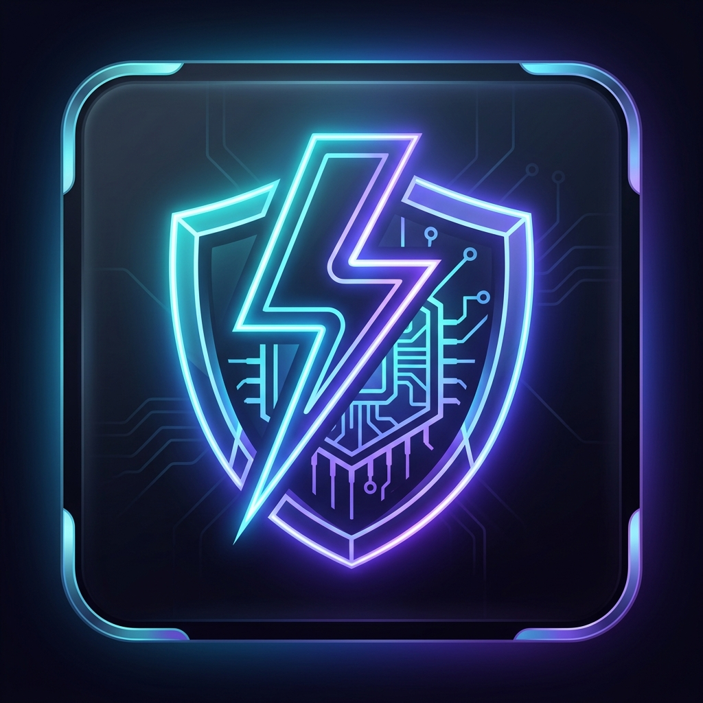

# TokenShield — AI Token & Cost Optimizer (Copilot & Claude)

<p align="center">
  
</p>

<p align="center">
  <strong>Universal AI Token & Cost Optimization Platform for Developers, Teams, and Enterprises.</strong><br>
  <em>Compatible with Google Antigravity IDE, GitHub Copilot, Cursor, Windsurf, Claude Code, and Codex.</em>
</p>

<p align="center">
  <a href="#-step-by-step-installation-guide">Installation</a> •
  <a href="#-the-19-optimization-features">Optimization Features</a> •
  <a href="#-real-time-savings-dashboard--activity-log">Savings Dashboard</a> •
  <a href="#-commands--keybindings">Commands</a> •
  <a href="#-configuration-reference-settingsjson">Configuration</a> •
  <a href="#-multi-editor-mcp-integration">MCP Integration</a>
</p>

---

## 🌟 Why TokenShield?

AI coding assistants (Copilot, Claude, Gemini, GPT-4o) frequently consume tens of thousands of redundant tokens by re-reading build bundles, lockfiles, verbose test logs, repetitive system instructions, and conversational filler.

**TokenShield acts as a zero-latency, 100% on-device efficiency layer** that enforces intelligent caching, AST structural pruning, context noise exclusion, and unified diff editing across all your favorite IDEs.

### 🏆 Key Benchmarked Gains:
- **~75–95% context reduction** during file navigation using AST Signatures (`skeleton_view`).
- **~92% output token savings** by enforcing unified diff patches instead of full 500-line file rewrites.
- **100% free answer reuse (<2ms latency)** via local on-disk semantic caching (`.aicache/`).
- **~500,000+ tokens blocked per workspace scan** by automatically excluding `dist/`, lockfiles, and minified bundles.
- **30–50% prompt compression** with the built-in Adaptive Context Pruner (`prune_context`).

---

## ⚡ The 19 Optimization Features

TokenShield comes equipped with 19 modular optimizations, active right out of the box:

| Category | Optimization Feature | How It Works | Measured Gain |
|---|---|---|---|
| **Code Search** | **CodeGraph Pre-Indexing** | Uses AST symbol graphs to find files instead of wide grep scans | **~97% savings** vs multi-file grep |
| **Terminal** | **CLI Output Compression** | Strips build spinners, git noise, and verbose logs via RTK/inline filters | **60–90%** terminal log reduction |
| **Prompt Filter** | **Concise AI Responses** | Strips conversational filler, apologies, and greetings from AI responses | **~35%** output token reduction |
| **Session** | **Context Compaction** | Prunes stale multi-turn history and drops redundant tool output | Prevents context window bloat |
| **Disk Cache** | **Semantic Cache** | Local semantic cache serving repeat answers instantly at $0.00 cost | **100% savings** on repeated queries |
| **AST Parser** | **AST Skeletons** | Extracts types, classes, and function signatures without full bodies | **75–95%** file inspection savings |
| **Exclusions** | **Smart Context Exclusions** | Auto-excludes `dist/**`, `package-lock.json`, and minified assets | **~500k tokens** blocked per scan |
| **Patch Editing** | **Diff-Only Output** | Outputs targeted diff hunks (±3 lines) rather than rewriting full files | **~92%** reduction on code changes |
| **Safety** | **Loop Guardrails** | Halts runaway retry loops after 3 consecutive autonomous failures | Prevents runaway credit burn |
| **Routing** | **Smart Model Routing** | Routes routine tasks (formatting, typos, minor edits) to lighter models | **Up to 99% cost reduction** |
| **Git Scope** | **Git Diff Scoping** | Scopes code reviews and unit test generation strictly to git diff lines | **~85% context reduction** |
| **Cloud Cache** | **Prompt Prefix Caching** | Maintains byte-stable instruction prefixes to unlock cloud KV cache hits | **Up to 90% cloud discounts** |
| **Minifier** | **Comment & Header Stripper** | Strips license preambles and low-signal filler comments on file reads | **~30%** context reduction |
| **Test Runner** | **Test Failure Isolator** | Captures failing assertions and stack traces while stripping passing suites | **~95%** test log compression |
| **Range Slicer** | **Windowed Range Slicing** | Restricts large file reads to 100-line windows around symbol targets | **~80%** reduction on file lookups |
| **Editor Scope** | **Inline Chat Scope Lock** | Constrains inline editor chat strictly to selected lines and dependencies | **~85%** prompt reduction |
| **Rules** | **.copilotignore Generator** | Maintains project-level `.copilotignore` rules to block build noise | Blocks secrets and artifacts |
| **Session Cache** | **Edit Session Awareness** | Treats files open in multi-file edit sessions as already loaded | Avoids redundant tool re-reads |
| **Monitor** | **Context Saturation Monitor** | Proactively suggests a fresh chat thread when conversation exceeds 40 turns | Prevents quality degradation |

---

## 🚀 Step-by-Step Installation Guide

TokenShield works seamlessly across all major AI coding environments:

### 1. Google Antigravity IDE
TokenShield has first-class native support for Antigravity IDE:

#### Method A: Direct VSIX Installation (Recommended)
1. Open Antigravity IDE.
2. Press `Ctrl+Shift+P` (Windows/Linux) or `Cmd+Shift+P` (macOS).
3. Type **`Extensions: Install from VSIX...`** and press Enter.
4. Select the `tokenshield.vsix` package.
5. Reload the window (`Ctrl+Shift+P` → `Developer: Reload Window`).

#### Method B: Extension Runtime Directory Sync
```powershell
# Windows
Copy-Item -Path ".\dist\*" -Destination "$HOME\.antigravity-ide\extensions\tokenshield\dist\" -Recurse -Force
Copy-Item -Path ".\package.json" -Destination "$HOME\.antigravity-ide\extensions\tokenshield\package.json" -Force
```

---

### 2. Visual Studio Code & VS Code Insiders
Works with GitHub Copilot, Copilot Chat, and Codex:

```bash
code --install-extension tokenshield.vsix
```

Or via the GUI:
1. Open VS Code → Extensions (`Ctrl+Shift+X`).
2. Click **`...` (Views and More Actions)** at top-right.
3. Choose **`Install from VSIX...`** and select the package.

---

### 3. Cursor & Windsurf IDE
```bash
cursor --install-extension tokenshield.vsix
```
Or use the Command Palette (`Ctrl+Shift+P`) → `Extensions: Install from VSIX...`.

---

### 4. Claude Code CLI & Standalone Agents
TokenShield includes an on-disk MCP server (`dist/cache-server.js`) providing immediate access to `cache_lookup`, `cache_store`, `skeleton_view`, and `prune_context`.

#### Configure Claude Code (`~/.claude.json`):
```json
{
  "mcpServers": {
    "token-cache": {
      "command": "node",
      "args": [
        "/path/to/tokenshield/dist/cache-server.js",
        "/path/to/your/workspace"
      ]
    }
  }
}
```

---

## 🔴 Real-Time Savings Dashboard & Activity Log

TokenShield features a modern **Glassmorphism Savings Dashboard** that tracks your token savings and estimated spend reduction in real time:

- **Tokens Saved Counter**: Live session savings aggregated across AST skeletons, semantic caching, exclusions, and diff modifications.
- **Estimated Spend Reduction ($)**: Calculated using active model rates (Gemini Flash, Haiku, GPT-4o, Claude Sonnet/Opus).
- **Live Activity Log**: Every single optimization event tracked with timestamps, target file, exact tokens saved, and mechanism.
- **Visual Donut & Progress Metrics**: Clean visual health bars and efficiency gauges for all 19 optimization features.

### How to Access:
- Press `Ctrl+Shift+P` → **`TokenShield: Open Savings Dashboard`**
- Or click the **`$(shield) TS:`** badge in the bottom status bar!

---

## ⌨️ Commands & Keybindings

All commands are registered under the clean `tokenshield.*` namespace:

| Command Title | Command ID | Description |
|---|---|---|
| **TokenShield: Open Savings Dashboard** | `tokenshield.dashboard` | Open visual savings dashboard with live activity log |
| **TokenShield: Show Session Breakdown** | `tokenshield.sessionBreakdown` | QuickPick breakdown of per-query savings events |
| **TokenShield: Start New Session** | `tokenshield.newSession` | Reset active counters and archive current session to history |
| **TokenShield: Switch Profile** | `tokenshield.switchProfile` | Switch between `full`, `debug`, `planning`, `review`, and `custom` |
| **TokenShield: Toggle On/Off** | `tokenshield.toggle` | Globally enable or disable all TokenShield optimizations |
| **TokenShield: Prune & Copy to Clipboard** | `tokenshield.pruneAndCopy` | Compresses active file or selection (30–50% savings) to clipboard |
| **TokenShield: Compress Git Diff** | `tokenshield.compressDiff` | Compresses current git diff for token-efficient PR reviews |
| **TokenShield: Edit Context Exclusions** | `tokenshield.exclusions` | Interactive picker for build folder, lockfile, and bundle filters |
| **TokenShield: Run Health Check** | `tokenshield.healthCheck` | Live diagnostic validation across all 19 optimization features |
| **TokenShield: Flush Semantic Cache** | `tokenshield.flushCache` | Clears local disk cache in `.aicache/semantic-cache.json` |
| **TokenShield: Reindex Code Graph** | `tokenshield.reindex` | Triggers a fresh AST symbol graph index in `.codegraph/` |
| **TokenShield: Export Savings Report** | `tokenshield.exportReport` | Exports clean savings reports in Markdown, JSON, or CSV format |
| **TokenShield: Regenerate Directives** | `tokenshield.regenerate` | Updates AI instruction files (`AGENTS.md`, `.github/`, `CLAUDE.md`) |
| **TokenShield: Initialize Project** | `tokenshield.init` | Analyzes workspace stack and generates customized instruction files |
| **TokenShield: Setup CLI Tools** | `tokenshield.setupTools` | Verifies and configures optional CLI acceleration tools (RTK, CodeGraph) |

---

## ⚙️ Configuration Reference (`settings.json`)

Configure TokenShield via `.vscode/settings.json` or your user settings under the `tokenshield` namespace:

```json
{
  "tokenshield.enabled": true,
  "tokenshield.profile": "full",
  "tokenshield.autoApply": true,
  "tokenshield.useVscodeStorage": true,
  "tokenshield.telemetry.enabled": true,
  "tokenshield.verbosityLevel": "full",
  "tokenshield.activeStrategies": {
    "codeGraph": true,
    "outputCompression": true,
    "verbosityControl": true,
    "sessionManagement": true,
    "semanticCache": true,
    "astSkeleton": true,
    "contextExclusion": true,
    "diffOnlyOutput": true,
    "agentGuardrails": true,
    "smartModelRouting": true,
    "gitDiffContext": true,
    "kvCacheAlignment": true,
    "commentStripper": true,
    "testFailureIsolator": true,
    "rangeSlicing": true,
    "inlineChatScopePinning": true,
    "copilotIgnoreGeneration": true,
    "copilotEditsAwareness": true,
    "threadResetTrigger": true
  },
  "tokenshield.guardrails": {
    "maxRetries": 3,
    "maxFilesPerTask": 10,
    "maxFileReads": 2
  },
  "tokenshield.pricing": {
    "flagship": { "inputPerMillion": 15.0, "outputPerMillion": 75.0 },
    "standard": { "inputPerMillion": 3.0, "outputPerMillion": 15.0 },
    "lightweight": { "inputPerMillion": 0.15, "outputPerMillion": 0.60 }
  }
}
```

---

## 🔒 100% Security & Privacy Guarantee

- **Zero Cloud Leakage**: 100% on-device local execution. No source code or telemetry ever leaves your machine.
- **Offline & Air-Gapped Friendly**: Fully functional without internet connectivity.
- **Zero Repo Clutter**: Local configuration stored in `.vscode/` by default — never touches git tracking unless explicitly exported.

---

## 📄 License
MIT License. Built for developers and modern software engineering teams.

